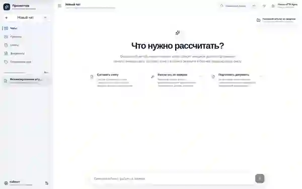
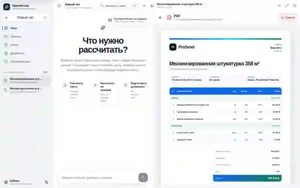
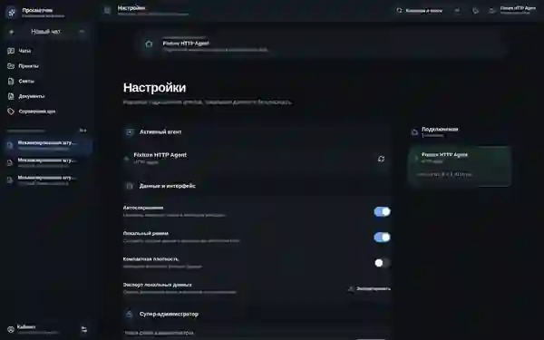
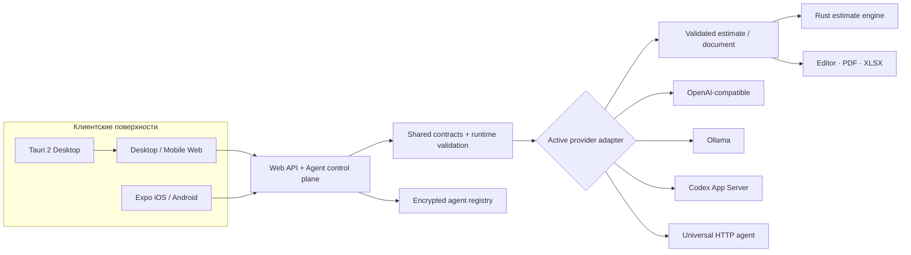

<div align="center">

# Просметчик · Greenfield V3

**Assistant-first рабочая среда для диалогов, строительных расчётов, смет, документов и внешних AI-агентов.**

[Открыть production](https://kolibriai.online) · [Быстрый старт](#быстрый-старт) · [Архитектура](#архитектура) · [Release gates](#release-gates)

[](https://github.com/leontov/prosmet/actions/workflows/greenfield-ci.yml)
[](https://github.com/leontov/prosmet/actions/workflows/greenfield-deploy.yml)
[](https://kolibriai.online)
[](./package.json)
[](./apps/web/package.json)
[](./apps/web/package.json)
[](./crates/estimate-engine)

<picture>
  <source media="(prefers-color-scheme: dark)" srcset="./docs/readme/prosmet-hero-dark.webp">
  
</picture>

</div>

> [!IMPORTANT]
> Это чистое Greenfield-дерево. Legacy shell, старые страницы и CSS-слои, демонстрационные сметы, hardcoded production-данные и fake responder не являются частью канонического runtime. Каноническая production-ветка — [`main`](https://github.com/leontov/prosmet/tree/main).

## Что представляет собой Просметчик

Просметчик строит рабочий процесс вокруг диалога с подключённым агентом: пользователь формулирует задачу, провайдер возвращает типизированный результат, сервер валидирует документ, а приложение открывает его в редактируемом канвасе. Один продуктовый контур охватывает:

- assistant-first чат без встроенных фиктивных ответов;
- редактируемые сметы, расчёты и проектные артефакты;
- экспорт результата в PDF и XLSX;
- web, mobile web, iOS, Android и desktop native;
- серверный control plane для внешних AI-агентов;
- независимый Rust-движок расчётов без AI-зависимостей.

Пока активный агент не настроен, UI возвращает явную ошибку конфигурации. Смета открывается только из фактического валидного ответа провайдера.

## Интерфейс

Изображения ниже — реальные Playwright screenshots из Greenfield Quality evidence, а не рекламные макеты.

<table>
  <tr>
    <td width="68%" valign="top">
      
      <br><sub><b>Desktop Web.</b> Чат как основной процесс, библиотеки данных слева и результат в отдельном канвасе.</sub>
    </td>
    <td width="32%" valign="top">
      
      <br><sub><b>Mobile Web.</b> Отдельная мобильная композиция и крупные карточки редактирования.</sub>
    </td>
  </tr>
  <tr>
    <td width="50%" valign="top">
      
      <br><sub><b>Document canvas.</b> Предпросмотр формируемого PDF рядом с рабочим диалогом.</sub>
    </td>
    <td width="50%" valign="top">
      
      <br><sub><b>Agent control plane.</b> Проверка, активация и переключение подключений без раскрытия секретов.</sub>
    </td>
  </tr>
</table>

## Продуктовые поверхности

| Поверхность | Роль | Реализация |
|---|---|---|
| **Desktop Web** | Чат, библиотеки реальных данных, редактор результата и документы | React 19.2, Vite 8, assistant-ui LocalRuntime |
| **Mobile Web** | Отдельная адаптивная композиция без постоянной нижней навигации | React, responsive web shell, card-based estimate editor |
| **iOS / Android** | Нативный клиент, сессия пользователя и защищённая конфигурация | Expo SDK 57, React Native 0.86, assistant-ui primitives, SecureStore |
| **Desktop Native** | Shell для macOS, Windows и Linux с узкой IPC-границей | Tauri 2, typed commands, least-privilege capabilities |
| **Расчётный контур** | Детерминированные вычисления независимо от AI-провайдера | Rust crate `prosmet-estimate-engine` |
| **Agent control plane** | Реестр, тестирование, активация и защищённое хранение подключений | Server API, runtime validation, AES-256-GCM |

## Архитектура



Клиенты используют общие контракты из [`packages/contracts`](./packages/contracts). Сервер выбирает только активное подключение, нормализует ответ адаптера и не передаёт невалидный документ в редактор.

## Подключаемые агенты

| Тип | Назначение | Транспорт |
|---|---|---|
| **OpenAI-compatible** | OpenAI API, MiMo gateway и совместимые сервисы | `POST /chat/completions` |
| **Ollama** | Локальные модели | `POST /api/chat` |
| **Codex App Server** | Полный Codex runtime | JSONL/stdio: `initialize → thread/start → turn/start → events` |
| **HTTP agent** | Собственный агентный сервис | Универсальный JSON request/response contract |

Супер-администратор может добавить подключение, сохранить credential, выполнить connection test, активировать провайдера, изменить конфигурацию или удалить её из web/mobile settings.

<details>
<summary><strong>Универсальный HTTP-agent contract</strong></summary>

### Запрос

```json
{
  "messages": [
    { "role": "user", "content": "Составь смету..." }
  ],
  "instructions": "системный контракт приложения",
  "responseSchema": {},
  "context": {
    "application": "prosmet-greenfield",
    "releaseSha": "..."
  }
}
```

### Ответ без документа

```json
{
  "text": "Уточните регион и объём",
  "artifact": null,
  "estimate": null
}
```

### Ответ со сметой

```json
{
  "text": "Смета подготовлена",
  "artifact": "estimate",
  "estimate": {
    "id": "...",
    "title": "...",
    "project": "...",
    "customer": "...",
    "region": "...",
    "revision": 1,
    "status": "draft",
    "overheadPercent": 0,
    "profitPercent": 0,
    "vatPercent": 0,
    "updatedAt": "2026-07-31T00:00:00.000Z",
    "sections": []
  }
}
```

Production server проверяет контракт и не открывает структурно невалидный документ.

</details>

## Безопасность control plane

Для production администраторский токен предпочтительно передавать процессу через окружение:

```bash
PROSMET_ADMIN_TOKEN='<длинный случайный токен>'
```

При отсутствии переменной сервер генерирует токен один раз и сохраняет его с правами `0600`:

```text
$HOME/.prosmet-greenfield/config/admin.token
```

Реестр агентов и ключ шифрования находятся в том же закрытом config root:

```text
$HOME/.prosmet-greenfield/config/agents.json
$HOME/.prosmet-greenfield/config/agents.key
```

Ключи и токены:

- шифруются на сервере через AES-256-GCM;
- не возвращаются web/mobile клиенту;
- не должны попадать в Git, browser bundle или GitHub Actions artifacts;
- на мобильном устройстве API URL и администраторский токен хранятся через Expo SecureStore.

## Быстрый старт

### Требования

- Node.js `>=22.13 <23` — CI использует `22.16.0`;
- npm с поддержкой workspaces;
- stable Rust toolchain;
- Chromium для Playwright acceptance.

### Запуск web

```bash
git clone https://github.com/leontov/prosmet.git
cd prosmet
npm ci --workspaces --include-workspace-root --legacy-peer-deps --no-audit --no-fund
npm run dev
```

Web dev server откроется на `http://localhost:5173`.

### Полная локальная проверка

```bash
npm run verify
npm run desktop:metadata
npm run desktop:verify
npx playwright install chromium
npm run e2e
npm run lighthouse:landing
```

Локальный E2E запускает отдельный HTTP-agent fixture и подключает его через тот же публичный admin API, которым пользуется production UI. Fixture не входит в production runtime.

## Структура репозитория

```text
apps/
├── web/                  web UI, API и production static server
├── mobile/               Expo / React Native приложение
└── desktop/              Tauri 2 shell и typed IPC
packages/
└── contracts/            общие TypeScript-типы и API-контракты
crates/
└── estimate-engine/      независимый Rust-движок расчёта
deployment/               persistent process и HTTPS edge recovery
docs/                     архитектура и продуктовая документация
scripts/                  contract, quality и release guards
.github/workflows/         quality, production и recovery pipelines
```

| Область | Путь |
|---|---|
| Web runtime | [`apps/web`](./apps/web) |
| Mobile runtime | [`apps/mobile`](./apps/mobile) |
| Desktop runtime | [`apps/desktop`](./apps/desktop) |
| Shared contracts | [`packages/contracts`](./packages/contracts) |
| Rust engine | [`crates/estimate-engine`](./crates/estimate-engine) |
| Deployment recovery | [`deployment`](./deployment) |
| Architecture docs | [`docs`](./docs) |

## Release gates

Публикация не считается завершённой только потому, что сборка прошла. Канонический release path требует точного SHA `main`, устойчивого процесса после cleanup runner и внешней проверки публичного HTTPS.

| Gate | Что проверяется |
|---|---|
| [`greenfield-contract.mjs`](./scripts/greenfield-contract.mjs) | Отсутствие legacy UI, demo estimates, hardcoded production-данных, fake responder и временного runtime |
| [`openapi-contract.mjs`](./scripts/openapi-contract.mjs) | Согласованность публичного API-контракта |
| [`desktop-ipc-contract.mjs`](./scripts/desktop-ipc-contract.mjs) | Узкая typed IPC-граница и least-privilege desktop capabilities |
| `typecheck → unit → Rust → build` | TypeScript, Vitest, Cargo tests и production build |
| Playwright desktop/mobile | Критические пользовательские маршруты, lifecycle и visual evidence |
| Lighthouse | Бюджеты landing performance и accessibility |
| Exact-SHA production deploy | Checkout и публикация только требуемого SHA `main` |
| Post-cleanup persistence | Node process и edge пережили завершение GitHub Runner job |
| Public edge | HTTPS, redirect, health и release SHA на `kolibriai.online` |
| External live acceptance | Desktop/mobile Chromium против production URL с реальным active-agent path |

Основные workflows:

- [`Prosmet Greenfield Quality`](./.github/workflows/greenfield-ci.yml);
- [`Prosmet Greenfield Production`](./.github/workflows/greenfield-deploy.yml);
- [`Prosmet Public Root Recovery`](./.github/workflows/public-root-recovery.yml).

## Greenfield-инварианты

Production tree не должен возвращать:

- legacy shell или старые страницы;
- демонстрационные сметы и фиктивные ответы;
- hardcoded пользователей, объекты или устройства;
- export/share controls без рабочего действия;
- provider registry без адаптеров и encrypted secret storage;
- временный Node/Caddy process, уничтожаемый cleanup GitHub Runner.

---

<div align="center">

**Production:** [kolibriai.online](https://kolibriai.online) · **Branch:** [`main`](https://github.com/leontov/prosmet/tree/main) · **Repository:** [`leontov/prosmet`](https://github.com/leontov/prosmet)

</div>
