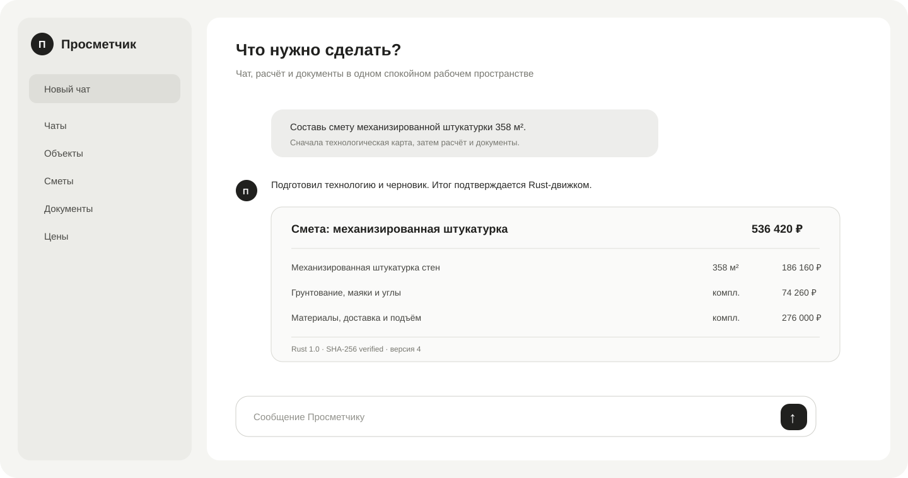
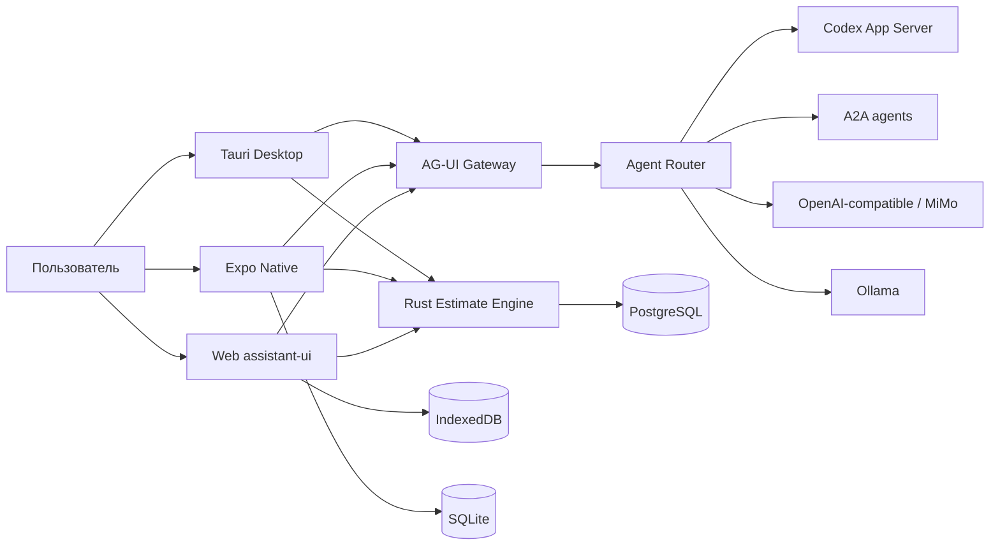

<div align="center">
  

# Просметчик

### Универсальный assistant-first продукт для смет, документов, цен и подключаемых AI-агентов

[](https://github.com/leontov/prosmet/actions/workflows/launch-3200.yml)
[](https://github.com/leontov/prosmet/actions/workflows/universal-quality.yml)
[](https://github.com/leontov/prosmet/actions/workflows/pr-quality.yml)

**Web · iOS · Android · macOS · Windows · Linux**

</div>

## Продукт

Просметчик превращает обычный диалог в профессиональный рабочий результат: технологическую карту, ресурсную ведомость, смету, коммерческое предложение, договор, счёт и акт. Интерфейс остаётся лаконичным и GPT-like; сложность расчётов, синхронизации и агентной фабрики скрыта за чатом и открывается только по задаче.

Это не жёстко прошитая «строительная форма». Каждый клиент получает tenant-манифест с нужными модулями, терминологией и правами. Та же платформа может стать виртуальной сметной конторой, проектным офисом, сервисным приложением или отраслевым помощником.

## Платформы

| Поверхность | Технология | Назначение |
|---|---|---|
| Web | Next.js 16, React 19, assistant-ui, AG-UI | Основное рабочее пространство и администрирование |
| iOS / Android | Expo SDK 57, React Native 0.86, assistant-ui native | Замер, чат, редактирование, offline SQLite, PDF/share |
| Desktop | Tauri 2 + Rust | Защищённая оболочка для macOS, Windows и Linux |
| Calculation | Rust `prosmet-engine` | Авторитетный детерминированный расчёт и SHA-256 digest |
| Data | PostgreSQL + IndexedDB / SQLite outbox | Общая база и local-first работа |
| Agents | Codex App Server, A2A v1, AG-UI, OpenAI-compatible, Ollama | Единый подключаемый контур агентов |

## Ключевой пользовательский путь

```text
сообщение → технология → ресурсы → смета → редактирование → Rust-проверка
→ утверждённая версия → КП / договор / счёт / акт → PDF/XLSX → передача клиенту
```

- цены имеют регион, дату, источник, статус и историю;
- утверждённые цены становятся опытом пользователя/организации;
- каждый документ связан с неизменяемой версией сметы;
- offline-правки попадают в outbox и синхронизируются с PostgreSQL;
- AI интерпретирует задачу, но не подменяет детерминированный расчёт.

## Архитектура



Подробности: [`docs/UNIVERSAL_ARCHITECTURE.md`](docs/UNIVERSAL_ARCHITECTURE.md).

## Репозиторий

```text
app/                         Next.js routes and APIs
components/                  premium GPT-like web surface
lib/domain/                  deterministic product contracts
lib/server/agents/           Codex, A2A, AG-UI and provider adapters
crates/prosmet-engine/       authoritative Rust engine
apps/mobile/                 Expo iOS / Android application
apps/desktop/                Tauri desktop application
deployment/                  PostgreSQL, immutable deploy, HTTPS
docs/                        architecture, security, product and release gates
```

## Запуск

### Web

```bash
npm ci
bash deployment/provision-postgres.sh
source "$HOME/.prosmet/database.env"
node deployment/migrate-postgres.mjs
npm run engine:build
npm run dev
```

### Native

```bash
cd apps/mobile
npm ci
npm run typecheck
npm run ios       # macOS + Xcode
npm run android   # Android SDK / emulator
```

### Desktop

```bash
cd apps/desktop
npm ci
npm run dev
```

## Проверка качества

```bash
npm run source:contract
npm run typecheck
npm run test
npm run build
npm run e2e
npm run engine:test
npm run mobile:typecheck
npm run desktop:check
```

`main` разворачивается только как неизменяемый релиз на Primary: PostgreSQL migration → source contract → typecheck → unit → production build → Chromium desktop/mobile → deploy 3200 → live smoke → HTTPS verification.

## Супер-администратор

Первый супер-администратор привязывается к уже созданной browser identity одной командой на Primary:

```bash
source "$HOME/.prosmet/database.env"
npm run admin:bootstrap -- \
  --owner 'guest:OWNER_FROM_API_IDENTITY' \
  --email 'owner@example.com'
```

Полная инструкция: [`docs/SUPERADMIN.md`](docs/SUPERADMIN.md). Изменение AI-провайдеров и tenant-манифеста в production разрешено только `super_admin`.

## Релизы в магазины

Конфигурации EAS и Tauri CI находятся в репозитории. Подписанный upload требует владельческих Apple/Google/Expo/Windows credentials, которые передаются только как encrypted environment secrets. См. [`docs/STORE_RELEASE.md`](docs/STORE_RELEASE.md).

## Безопасность и данные

- provider secrets: AES-256-GCM на сервере, никогда не возвращаются клиенту;
- tenant isolation: каждый запрос и sync-объект ограничен owner/tenant;
- внешний provider endpoint: HTTPS, кроме явно разрешённого локального Ollama;
- Rust binary запускается без shell, с ограниченным окружением, timeout и лимитом вывода;
- production CSP запрещает `unsafe-eval` и browser WASM;
- удаление чата не уничтожает подтверждённое ценовое знание организации;
- audit events фиксируют административные и ценовые изменения.

## Инвестиционный тезис

Просметчик соединяет четыре трудно копируемых слоя: consumer-grade диалоговый UX, проверяемый отраслевой расчёт, постоянно улучшающуюся базу цен/норм и нейтральную фабрику подключаемых агентов. Это позволяет конкурировать с тяжёлыми desktop-сметчиками качеством результата, но выигрывать скоростью внедрения, мобильностью и автоматизацией полного документооборота.

## Лицензия

Proprietary. Все права на продукт и исходный код сохраняются владельцем проекта.
