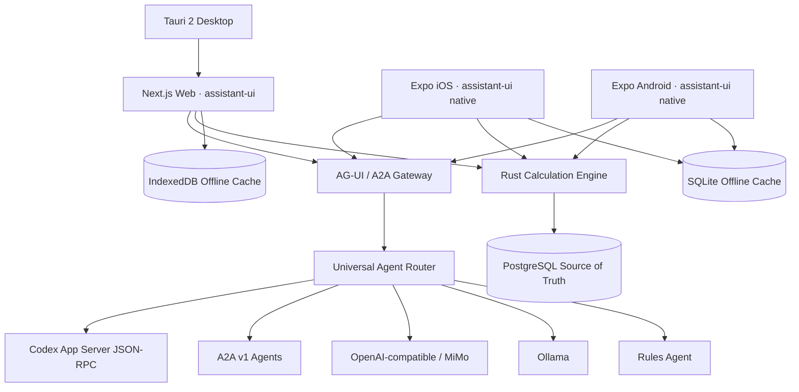

# Universal Prosmet Architecture

Prosmet is a universal assistant-first work system. A tenant manifest selects the modules, terminology and capabilities shown to each customer; the default surface stays quiet and GPT-like.

## Product boundaries

- assistant-ui owns chat primitives, runtime state, streaming, branching, tools and threads.
- AG-UI is the primary UI-to-agent event protocol; A2A is the external agent interoperability protocol.
- Codex App Server is the rich Codex integration; `codex exec` remains a compatibility path.
- PostgreSQL is the authoritative shared store. IndexedDB and native SQLite are offline caches with outboxes.
- Rust is the authoritative approval calculation. TypeScript/native calculations are previews and must match Rust before approval.
- Tenant manifests control visible modules without forking the application.

## Security invariants

Provider secrets never reach clients. Mutating provider and manifest APIs require a bootstrapped `super_admin`. Rust is spawned without a shell and with a bounded environment/output. External provider endpoints require HTTPS except explicitly allowed local Ollama endpoints.
